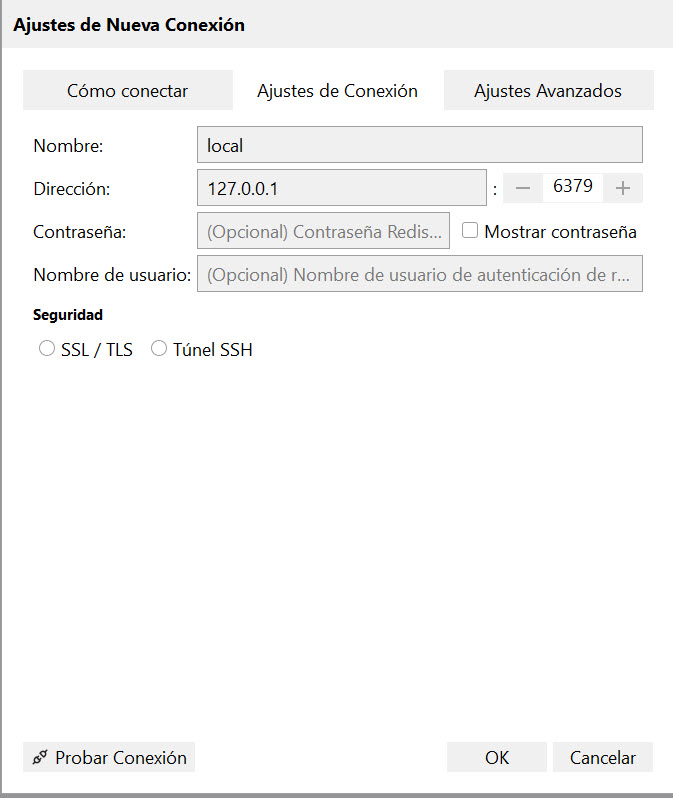
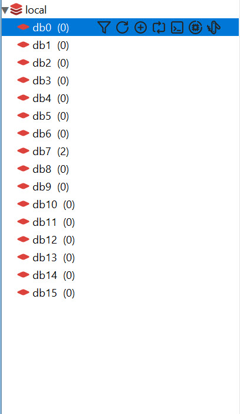

# configuración del cache usando Redis

edite el archivo del ambiente (.env)

```
CACHE_DRIVER=redis

REDIS_HOST=127.0.0.1
REDIS_PASSWORD=null
REDIS_PORT=6379
```

# agregar Redis en php (php 8.2)
Si no lo tiene configurado, configure Redis en PHP:

Copie el archivo php_redis.dll (incluido en este repositorio) en la carpeta de extensión de php, ejemplo c:\php\ext
Luego edite el archivo php.ini (c:\php\php.ini) y agregue la extensión
(junto con las lineas donde se agregan las extensiones)

```
extension=redis
```

# instalar el servidor de redis
Si no tiene instalado REDIS, instálelo:
Redis no tiene un instalador oficial en Windows, pero si hay un fork para Windows

https://github.com/tporadowski/redis/releases

Instálelo con las opciones por defecto

# instale una herramienta de GUI para redis

https://github.com/qishibo/AnotherRedisDesktopManager/releases

Y abra la herramienta para crear una nueva conexión (si es que no hay alguna conexión creada), con los datos por defecto.



Una vez conectado, puede explorar la base de datos. Redis tiene base de datos numeradas del 0 al 16



## Usar el cache

Para usar el cache vamos a usar la clase Cache (Illuminate\Support\Facades\Cache) y principalmente necesitamos los comandos get (leer) y set(escribir).

* El comando get permite seleccionar un valor por defecto si el valor no existe
* El comando set permite seleccionar la duración del valor.

Ejemplo:

```php
    public function listar(&$estaCache):Collection {
        $estaCache="el valor esta en el cache";
        $computadores=Cache::get('listado',null);  // busca si esta en el cache
        if($computadores===null) { # si no esta
            $estaCache="el valor no esta en el cache";
            $computadores=Computador::all(); // lo lee de la base de datos
            Cache::set('listado',$computadores,100); // y lo guarda en el cache por 100 segundos.
        }
        return $computadores;
    }
```

# Ejercicio

Modifique el ejercicio de la clase pasada para que todas las lecturas usen cache (no es necesario devolver un texto, como se hizo con el ejemplo de la función listar)
